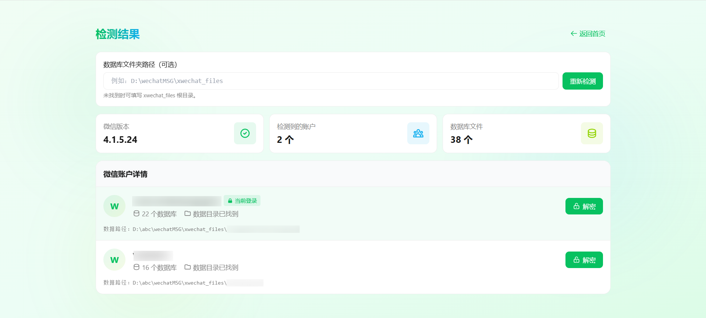
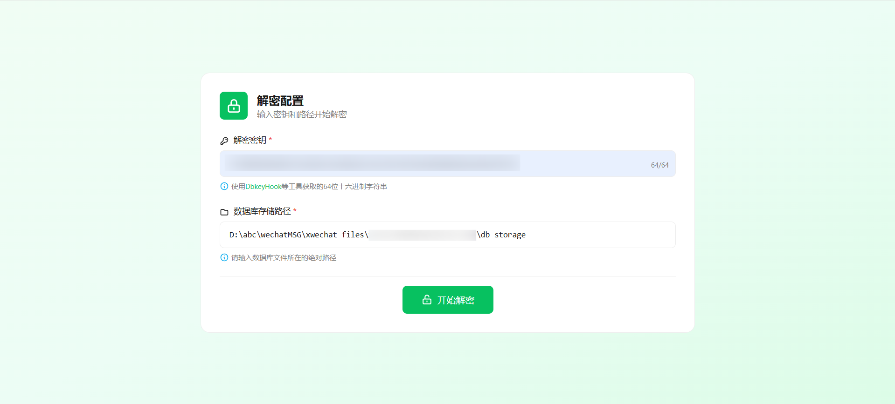
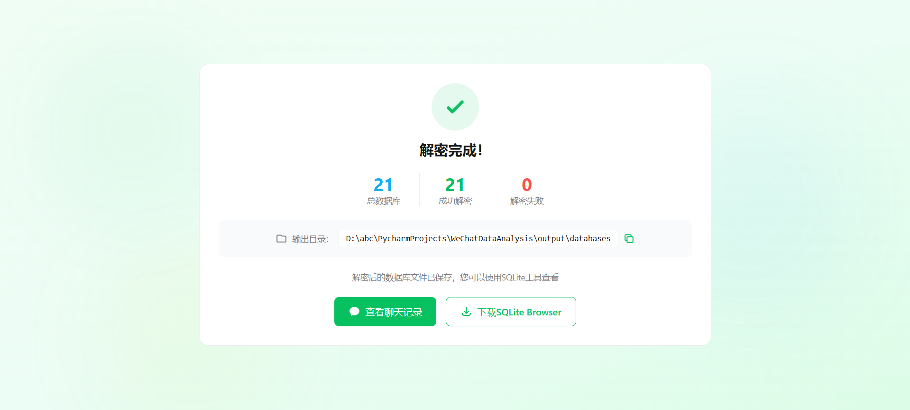
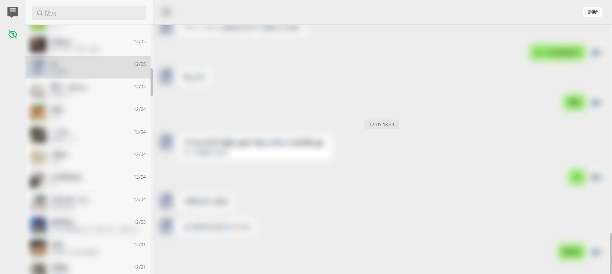

<div align="center">
  
</div>

# 微信数据库解密工具

一个专门用于微信4.x版本数据库解密的工具

## 界面预览

### 检测页面

<div align="center">
  
</div>

自动检测微信安装路径和数据库文件位置，支持多账户识别。

### 解密页面

<div align="center">
  
</div>

输入解密密钥，选择数据库文件进行批量解密操作。

### 解密成功页面

<div align="center">
  
</div>

解密完成后显示统计信息，可直接跳转查看聊天记录。

### 聊天记录页面

<div align="center">
  
</div>

> **注意**: 聊天记录页面目前仅完成了基础展示功能，包括消息列表、文本/图片/语音等基本消息类型的显示。更多功能（如搜索、导出、高级筛选等）尚在开发中，当前界面不代表最终成品。

## 功能特性

### 已实现功能

- **数据库解密**: 支持微信4.x版本数据库文件的解密
- **多账户检测**: 自动检测并处理多个微信账户的数据库文件
- **API接口**: 提供RESTful API接口进行数据库解密操作
- **Web界面**: 提供现代化的Web操作界面
- **聊天记录查看**: 支持查看解密后的聊天记录（基础功能）

### 开发计划

- **数据分析**: 对解密后的数据进行深度分析
- **数据可视化**: 提供图表、统计报告等可视化展示
- **聊天记录分析**: 消息频率、活跃时间、关键词分析等
- **聊天记录优化**: 搜索、导出、高级筛选等功能

> **项目进展**: 查看 [GitHub项目面板](https://github.com/orgs/LifeArchiveProject/projects/1/views/1) 了解当前开发状态和后续功能规划

## 快速开始

### 1. 克隆项目

```bash
git clone https://github.com/2977094657/WeChatDataAnalysis
```

### 2. 安装后端依赖

```bash
# 使用uv (推荐)
uv sync
```

### 3. 安装前端依赖

```bash
cd frontend
npm install
```

### 4. 启动服务

#### 启动后端API服务
```bash
# 在项目根目录
uv run main.py
```

#### 启动前端开发服务器
```bash
# 在frontend目录
cd frontend
npm run dev
```

### 5. 访问应用

- 前端界面: http://localhost:3000
- API服务: http://localhost:8000
- API文档: http://localhost:8000/docs

## 使用指南

### 获取解密密钥

在使用本工具之前，您需要先获取微信数据库的解密密钥。推荐使用以下工具：

**DbkeyHook** (推荐)
   - 项目地址: https://github.com/gzygood/DbkeyHook
   - 专门用于获取微信数据库密钥的工具

### 生成字段配置模板（JSON）

在完成数据库解密后（默认输出到 `output/databases/{账号名}/`），可基于实际解密出的数据库结构生成一份可填写的字段说明模板。

前置条件：
- `output/databases/{账号名}/*.db` 下已有解密后的数据库文件（通过后端 API 或命令行完成解密）。

运行命令：

```bash
uv run generate_config_template.py
```

输出结果：
- 在项目根目录生成 `wechat_db_config_template.json`

接下来：
- 打开并填写模板中的字段含义（`meaning`）、表/数据库功能描述（`description`），以及可选的 `message_types`、`friend_types` 映射示例。
- 填写完成后，将其另存为根目录下的 `wechat_db_config.json`（分析脚本默认读取此文件名）。

提示：若未提供 `wechat_db_config.json`，分析脚本会使用内置的最小默认映射，生成的文档字段含义将较为粗略。

### 生成数据库表结构文档（Markdown）

该脚本会扫描解密后的数据库，输出每个数据库与表的结构说明、示例数据以及跨库字段关联分析。

前置条件：
- `output/databases/{账号名}/*.db` 下已有解密后的数据库文件
-（可选）根目录存在 `wechat_db_config.json`，用于提供更准确的字段含义映射

运行命令：

```bash
uv run analyze_wechat_databases.py
```

输出结果：
- 文档目录：`output/docs/database/`
- 主要文件：
  - `README.md`：总览文档
  - `field_relationships.md`：跨数据库字段关联分析
  - `{数据库名}/README.md`：该数据库概览
  - `{数据库名}/{表名}.md`：各表详细结构、索引、外键、示例数据与建表语句

## 安全说明

**重要提醒**:

1. **仅限个人使用**: 此工具仅用于解密您自己的微信数据
2. **密钥安全**: 请妥善保管您的解密密钥，不要泄露给他人
3. **数据隐私**: 解密后的数据包含个人隐私信息，请谨慎处理
4. **合法使用**: 请遵守相关法律法规，不得用于非法目的

## 致谢

本项目的开发过程中参考了以下优秀的开源项目和资源：

### 主要参考项目

1. **[DbkeyHook](https://github.com/gzygood/DbkeyHook)** - 微信数据库密钥获取工具
   - 提供了获取微信数据库解密密钥的解决方案
   - 本项目推荐使用此工具获取密钥

2. **[wechat-dump-rs](https://github.com/0xlane/wechat-dump-rs)** - Rust实现的微信数据库解密工具
   - 提供了SQLCipher 4.0解密的正确实现参考
   - 本项目的HMAC验证和页面处理逻辑基于此项目的实现

3. **[oh-my-wechat](https://github.com/chclt/oh-my-wechat)** - 微信聊天记录查看工具
   - 提供了优秀的聊天记录界面设计参考
   - 本项目的聊天界面风格参考了此项目的实现

## Star History

[](https://www.star-history.com/#LifeArchiveProject/WeChatDataAnalysis&Date)

## 贡献

欢迎提交Issue和Pull Request来改进这个项目。

## 许可证

本项目仅供学习和个人使用。请遵守相关法律法规。

---

**免责声明**: 本工具仅供学习研究使用，使用者需自行承担使用风险。开发者不对因使用本工具造成的任何损失负责。